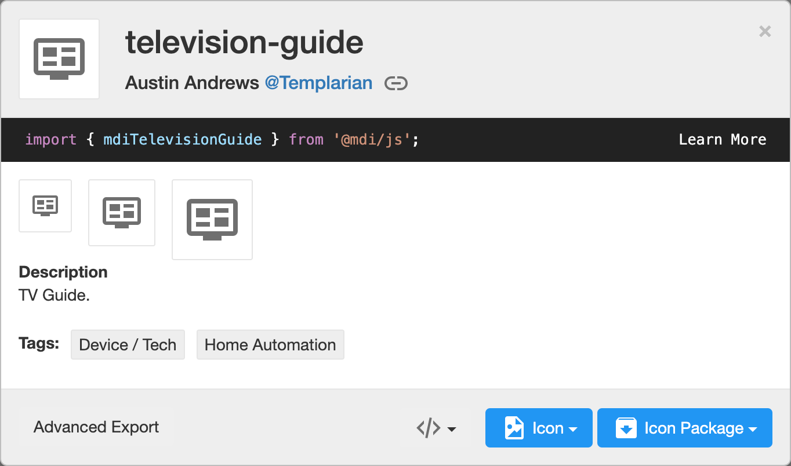

# TV Remote Card

[![GitHub Release][releases-shield]][releases]
[![License][license-shield]](LICENSE.md)
[](https://github.com/custom-components/hacs)
![Project Maintenance][maintenance-shield]
[![GitHub Activity][last-commit-shield]][commits]
[![Community Forum][forum-shield]][forum]

[![Github][github]][github]

📦 This repo is a fork of [tv-card](https://github.com/marrobHD/tv-card) and includes a bunch of new features and improvements, like:

- Fully functional touchpad for navigation (thanks to [iablon's Touchpad Card](https://github.com/iablon/HomeAssistant-Touchpad-Card)) ❤️
- Slider for volume (thanks to [AnthonMS's Slider Card](https://github.com/AnthonMS/my-cards#slider-card)) ❤️
- Supports [ollo69's SamsungTV Smart Component](https://github.com/ollo69/ha-samsungtv-smart)
- Much easier setup
- Implements haptics feedback
- Customizable layout, you can choose the order of the rows and buttons
- All rows and buttons are optional, you can change whatever you *(don't)* like

## Demo


## Options

| Name | Type | Requirement | Description
| ---- | ---- | ------- | -----------
| type | string | **Required** | `custom:tv-card`
| entity | string | **Required** | The `media_player` entity to control
| title | string | **Optional** | Card title for showing as header
| enable_double_click | boolean | **Optional** | Whether a double click on the touchpad should send the key in `double_click_keycode`. Defaults to `true`.
| double_click_keycode | string | **Optional** | The key for double clicks on the touchpad. Defaults to `KEY_RETURN`
| enable_button_feedback | boolean | **Optional** | Shall clicks on the buttons return a vibration feedback? Defaults to `true`.
| enable_slider_feedback | boolean | **Optional** | Shall the volume slider return a vibration feedback when you slide through it? Defaults to `true`.
| slider_config | object | **Optional** | Custom configuration for the volume slider. See [slider-card](https://github.com/AnthonMS/my-cards)
| custom_keys | object | **Optional** | Custom keys for the remote control. Each item is an object that should have `icon` and at least one of the following properties: `key`, `source`, `service`.
| custom_sources | object | **Optional** | Custom sources for the remote control. Same object as above, but letting you split keys and sources.

Using only these options you will get an empty card (or almost empty, if you set a title).
In order to include the buttons, you need to specify in the config the rows you want and which buttons you want in it.
You do it by declaring the rows as arrays and its buttons as values, like this:

```yaml
power_row:
  - power
media_control_row:
  - rewind
  - play
  - pause
  - fast_forward
```

The available rows are `power_row`, `channel_row`, `apps_row`, `source_row` and `media_control_row`
There also `volume_row` and `navigation_row`, but these requires a string as value.

| Name | Type | Description
| ---- | ---- | -------
| volume_row | string | Can be either `slider` or `buttons`. This defines the mode you want for setting the volume (you'll see them soon below).
| navigation_row | string | Can be either `touchpad` or `buttons`. This defines the mode you want for navigating around your tv (you'll also see them soon below).

## **Notice**

This card uses `media_player.play_media` to send keys to the TV.
This is the way [ollo69's SamsungTV Smart Component](https://github.com/ollo69/ha-samsungtv-smart) (which i based this card on) works, but don't worry: if your TV is from another brand or simply the TV integration does not use `media_player.play_media` for sending keys, you can still use this card by setting [custom buttons](#custom-buttons) with services to send keys to your TV (or do whatever you want) in your way (just like the original [tv-card](https://github.com/marrobHD/tv-card)).

## Custom buttons

If you want to add custom buttons to the remote control (of if you want to reconfigure the existing buttons), you can do it by adding an object to the `custom_keys` option:

```yaml
custom_keys:
  input_tv:
    icon: "mdiTelevisionBox"
    key: KEY_TV
  browser:
    icon: "mdiWeb"
    source: "browser"
  toggle_light:
    icon: "mdiLightbulb"
    service: light.toggle
    service_data:
      entity_id: light.bedroom
```

The `custom_sources` exists for the same purpose, but you can use it to split the keys and sources.

```yaml
custom_keys:
  input_tv:
    icon: "mdiTelevisionBox"
    key: KEY_TV
  toggle_light:
    icon: "mdiLightbulb"
    service: light.toggle
    service_data:
      entity_id: light.bedroom
custom_sources:
  browser:
    icon: "mdiWeb"
    source: "browser"
```

Then you can easily use these buttons in your card:

```yaml
power_row:
  - browser
  - power
  - input_tv
media_control_row:
  - rewind
  - play
  - pause
  - fast_forward
  - toggle_light
```


With custom buttons you can override existing buttons for changing its icon or even its functionality. Here i do both:

```yaml
custom_keys:
  power:
    icon: "mdiPowerCycle"
    service: media_player.toggle
    service_data:
      entity_id: media_player.tv
```

Inside each button you may define either `key`, `source` or `service`, as you've seen.

| Option | internal function | Description
| ---- | ---- | -------
| key | `media_player.play_media(media_content_id=key, media_content_type="send_key")` | The key to send to the TV via `media_player.play_media`
| source | `media_player.select_source(source=source)` | The source to switch to via `media_player.select_source`
| service | `_hass.callService(domain, service, service_data)` | A string representing service to call. Use the format `domain.service`, e.g. `"light.turn_on"`
| service_data | passed with `service` | The data to pass to the service. May be an object depending on the service you are using.

In the option `icon` you must pass the name of the javascript object that represents the icon using MDI. You can get those [here](https://materialdesignicons.com/).
Searching for "guide", you'll find `television-guide`:



See that pretty line of code in there? There's the name of the icon we want: `mdiTelevisionGuide`

```yaml
custom_keys:
  guide:
    icon: "mdiTelevisionGuide"
    key: KEY_GUIDE
```

## Installation

### Step 1

Install using HACS or [see this guide](https://github.com/thomasloven/hass-config/wiki/Lovelace-Plugins).

### Step 2

Add a custom element in your `ui-lovelace.yaml`

```yaml
      - type: custom:tv-card
        entity: media_player.tv
        power_row:
          - power
        channel_row:
          - channel_up
          - info
          - channel_down
        apps_row:
          - netflix
          - youtube
          - spotify
        volume_row: slider
        navigation_row: touchpad
        source_row:
          - return
          - home
          - source
        media_control_row:
          - rewind
          - play
          - pause
          - fast_forward
```

### Example 1

Playing with order, moving and repeating buttons:

```yaml
type: custom:tv-card
entity: media_player.tv
title: Example 1
power_row:
  - power
source_row:
  - return
  - home
  - source
  - netflix
apps_row:
  - youtube
  - spotify
  - netflix
navigation_row: touchpad
volume_row: slider
channel_row:
  - channel_up
  - channel_down
  - info
media_control_row:
  - rewind
  - play
  - spotify
  - pause
  - fast_forward
```

Result:


### Example 2

Buttons, buttons everywhere!

```yaml
type: custom:tv-card
entity: media_player.tv
title: Example 2
power_row:
  - power
channel_row:
  - channel_up
  - info
  - channel_down
apps_row:
  - netflix
  - youtube
  - spotify
volume_row: buttons
navigation_row: buttons
source_row:
  - return
  - home
  - source
media_control_row:
  - rewind
  - play
  - pause
  - fast_forward
```

Result:


### Example 3

Using less

```yaml
type: custom:tv-card
entity: media_player.tv
title: Example 3
power_row:
  - power
apps_row:
  - netflix
  - youtube
  - spotify
volume_row: slider
navigation_row: touchpad
source_row:
  - return
  - home
```

Result:


### Extra

In any row, if you add an ampty item, there will be an empty/invisible button filling the space:

```yaml
source_row:
  - return
  - home
  - source
media_control_row:
  - rewind
  -
  - 
  - fast-forward
```


[last-commit-shield]: https://img.shields.io/github/last-commit/usernein/tv-card?style=for-the-badge
[commits]: https://github.com/usernein/tv-card/commits/master
[forum-shield]: https://img.shields.io/badge/community-forum-brightgreen.svg?style=for-the-badge
[forum]: https://community.home-assistant.io/t/lovelace-an-awesome-modified-tv-card-with-touchpad-and-haptic-feedback/432791
[license-shield]: https://img.shields.io/github/license/usernein/tv-card.svg?style=for-the-badge
[maintenance-shield]: https://img.shields.io/badge/maintainer-usernein-blue.svg?style=for-the-badge
[releases-shield]: https://img.shields.io/github/release/usernein/tv-card.svg?style=for-the-badge
[releases]: https://github.com/usernein/tv-card/releases
[github]: https://img.shields.io/github/followers/usernein.svg?style=social
