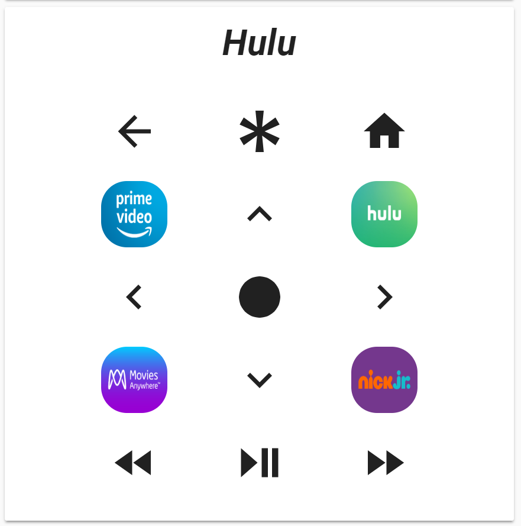
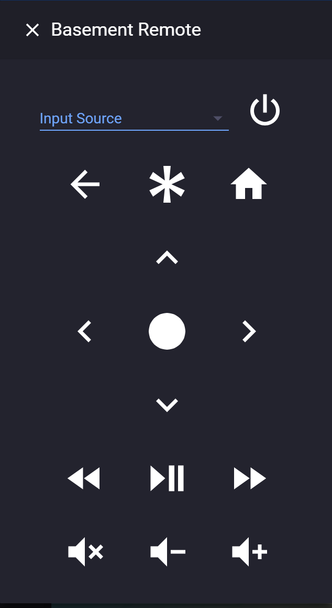

[](#) [](#)

[](#)

## Support
Hey dude! Help me out for a couple of :beers: or a :coffee:!

[](https://www.buymeacoffee.com/zJtVxUAgH)

# Roku Remote Card
💵 Roku Remote Lovelace Card

This card is for [Lovelace](https://www.home-assistant.io/lovelace) on [Home Assistant](https://www.home-assistant.io/) that display a [Roku](https://www.roku.com/) remote.

# NOTE: Firefox releases before 67 are not supported
https://twitter.com/_developit/status/1090364879377260544




## Options

| Name | Type | Requirement | Description
| ---- | ---- | ------- | -----------
| type | string | **Required** | `custom:roku-card`
| entity | string | **Required** | `media_player` entity of Roku device
| remote | string | **Optional** | `remote` entity of Roku device. Default assume named like `entity`
| name | string | **Optional** | Card name
| theme | string | **Optional** | Card theme
| tv | boolean | **Optional** | If `true` shows volume and power buttons. Default `false`
| power | `service` | **Optional**| service to call when power button pressed
| volume_up | `service` | **Optional**| service to call when volume_up button pressed
| volume_down | `service` | **Optional**| service to call when volume_down button pressed
| volume_mute | `service` | **Optional**| service to call when volume_mute button pressed

## `service` Options
| Name | Type | Requirement | Description
| ---- | ---- | ------- | -----------
| service | string | **Required** | Service to call
| service_data | string | **Optional** | Service data to use


## Installation

### Step 1

Install `roku-card` by copying `roku-card.js` and `roku-card-editor.js` from this repo to `<config directory>/www/roku-card.js` on your Home Assistant instance.

**Example:**

```bash
wget https://raw.githubusercontent.com/custom-cards/roku-card/master/roku-card.js
wget https://raw.githubusercontent.com/custom-cards/roku-card/master/roku-card-editor.js
mv roku-card* /config/www/
```

### Step 2

Link `roku-card` inside your `ui-lovelace.yaml`.

```yaml
resources:
  - url: /local/roku-card.js?v=0
    type: module
```

### Step 3

Add a custom element in your `ui-lovelace.yaml`

```yaml
      - type: custom:roku-card
        entity: media_player.bedroom_tv
        name: Bedroom TV
        theme: darkpurple
        tv: true
        power:
          service: switch.turn_on
          service_data:
            entity_id: switch.bedroom_tv_power
```

[Troubleshooting](https://github.com/thomasloven/hass-config/wiki/Lovelace-Plugins)
