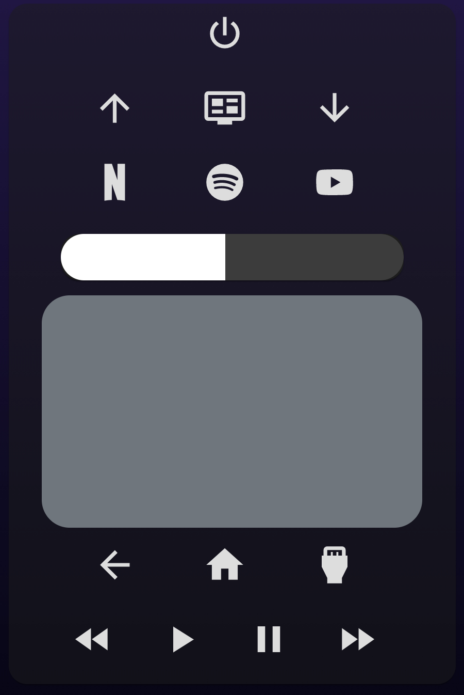
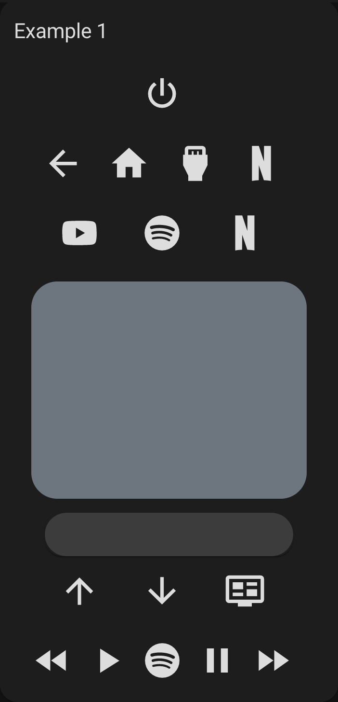
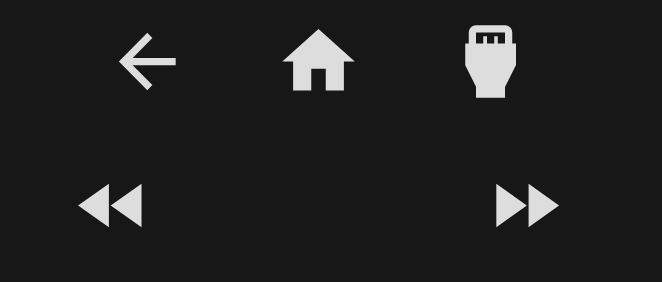

# TV Remote Card

[![GitHub Release][releases-shield]][releases]
[![License][license-shield]](LICENSE.md)

![Project Maintenance][maintenance-shield]
[![GitHub Activity][last-commit-shield]][commits]
[](https://github.com/custom-components/hacs)

[![Github][github]][github]

📦 This repo is a fork of [tv-card](https://github.com/marrobHD/tv-card) and includes a bunch of new features and improvements, like:

- Fully functional touchpad for navigation (thanks to [iablon's Touchpad Card](https://github.com/iablon/HomeAssistant-Touchpad-Card)) ❤️
- Slider for volume (thanks to [AnthonMS's Slider Card](https://github.com/AnthonMS/my-cards#slider-card)) ❤️
- Makes use of [ollo69's SamsungTV Smart Component](https://github.com/ollo69/ha-samsungtv-smart)
- Much easier setup
- Implements haptics feedback
- Customizable layout, you can choose the order of the rows and buttons
- All rows and buttons are optional

## Notice

⚠️ **Currently this fork probably works only with Samsung Smart TVs (Tizen)**, since i made it first for my personal use.

## Demo



## Options

| Name | Type | Requirement | Description
| ---- | ---- | ------- | -----------
| type | string | **Required** | `custom:tv-card`
| entity | string | **Required** | The `media_player` entity to control
| title | string | **Optional** | Card title for showing as header
| enable_double_click | boolean | **Optional** | Whether a double click on the touchpad should send the key in `double_click_keycode`. Defaults to `true`.
| double_click_keycode | string | **Optional** | The key for double clicks on the touchpad. Defaults to `KEY_RETURN`
| enable_button_feedback | boolean | **Optional** | Shall clicks on the buttons return a vibration feedback? Defaults to `true`.
| enable_slider_feedback | boolean | **Optional** | Shall the volume slider return a vibration feedback when you slide through it? Defaults to `true`.
| slider_config | object | **Optional** | Custom configuration for the volume slider. See [slider-card](https://github.com/AnthonMS/my-cards)

Using only these options you will get an empty card (or almost empty, if you set a title).
In order to include the buttons, you need to specify in the config the rows you want and which buttons you want in it.
You do it by declaring the rows as arrays and its buttons as values, like this:

```yaml
power_row:
  - power
media_control_row:
  - rewind
  - play
  - pause
  - fast_forward
```

The available rows are `power_row`, `channel_row`, `apps_row`, `source_row` and `media_control_row`
There also `volume_row` and `navigation_row`, but these requires a string as value.

| Name | Type | Description
| ---- | ---- | -------
| volume_row | string | Can be either `slider` or `buttons`. This defines the mode you want for setting the volume (you'll see them soon below).
| navigation_row | string | Can be either `touchpad` or `buttons`. This defines the mode you want for navigating around your tv (you'll also see them soon below).

## Installation

### Step 1

~~Install using HACS~~ or [see this guide](https://github.com/thomasloven/hass-config/wiki/Lovelace-Plugins).

### Step 2

Add a custom element in your `ui-lovelace.yaml`

```yaml
      - type: custom:tv-card
        entity: media_player.tv
        power_row:
          - power
        channel_row:
          - channel_up
          - info
          - channel_down
        apps_row:
          - netflix
          - youtube
          - spotify
        volume_row: slider
        navigation_row: touchpad
        source_row:
          - return
          - home
          - source
        media_control_row:
          - rewind
          - play
          - pause
          - fast_forward
```

### Example 1

Playing with order, moving and repeating buttons:

```yaml
type: custom:tv-card
entity: media_player.tv
title: Example 1
power_row:
  - power
source_row:
  - return
  - home
  - source
  - netflix
apps_row:
  - youtube
  - spotify
  - netflix
navigation_row: touchpad
volume_row: slider
channel_row:
  - channel_up
  - channel_down
  - info
media_control_row:
  - rewind
  - play
  - spotify
  - pause
  - fast_forward
```

Result:



### Example 2

Buttons, buttons everywhere!

```yaml
type: custom:tv-card
entity: media_player.tv
title: Example 2
power_row:
  - power
channel_row:
  - channel_up
  - info
  - channel_down
apps_row:
  - netflix
  - youtube
  - spotify
volume_row: buttons
navigation_row: buttons
source_row:
  - return
  - home
  - source
media_control_row:
  - rewind
  - play
  - pause
  - fast_forward
```

Result:


### Example 3

Using less

```yaml
type: custom:tv-card
entity: media_player.tv
title: Example 3
power_row:
  - power
apps_row:
  - netflix
  - youtube
  - spotify
volume_row: slider
navigation_row: touchpad
source_row:
  - return
  - home
```

Result:


### Extra

In any row, if you add an ampty item, there will be an empty/invisible button filling the space:

```yaml
source_row:
  - return
  - home
  - source
media_control_row:
  - rewind
  -
  - 
  - fast-forward
```



[last-commit-shield]: https://img.shields.io/github/last-commit/usernein/tv-card?style=for-the-badge
[commits]: https://github.com/usernein/tv-card/commits/master
[forum-shield]: https://img.shields.io/badge/community-forum-brightgreen.svg?style=for-the-badge
[forum]: https://community.home-assistant.io/t/lovelace-tv-remote-card/91476
[license-shield]: https://img.shields.io/github/license/usernein/tv-card.svg?style=for-the-badge
[maintenance-shield]: https://img.shields.io/badge/maintainer-usernein-blue.svg?style=for-the-badge
[releases-shield]: https://img.shields.io/github/release/usernein/tv-card.svg?style=for-the-badge
[releases]: https://github.com/usernein/tv-card/releases
[github]: https://img.shields.io/github/followers/usernein.svg?style=social
