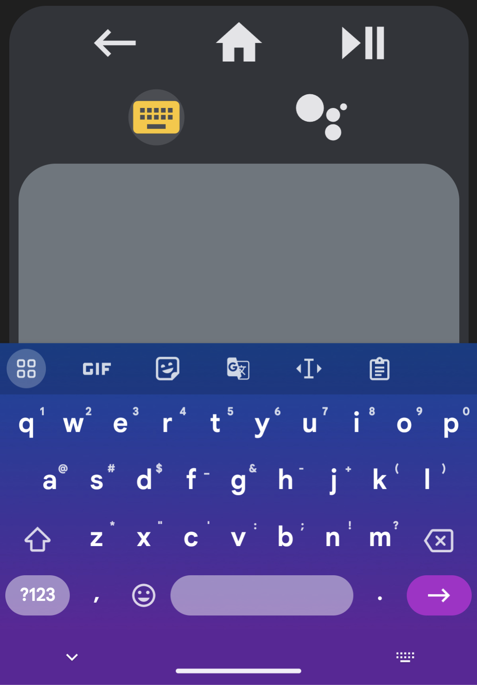
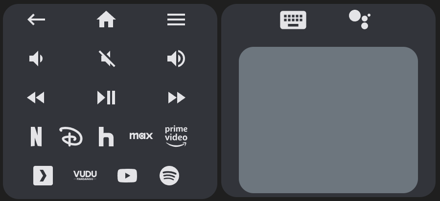
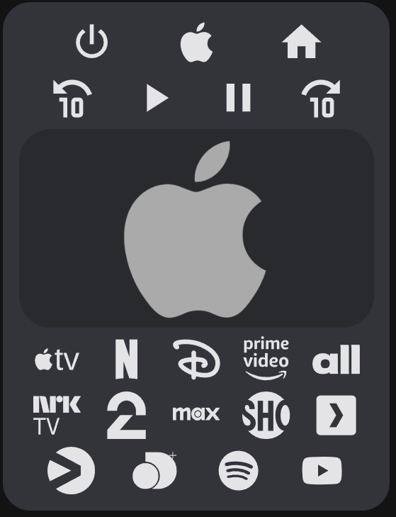
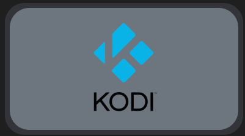
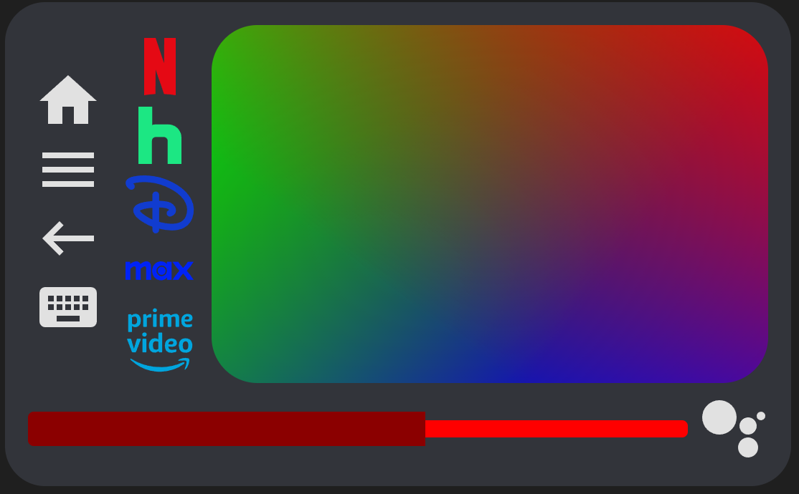
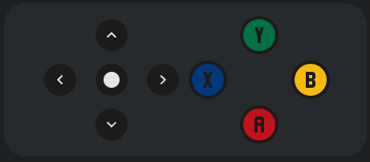

# Android TV Remote Card

[![GitHub Release][releases-shield]][releases]
[![License][license-shield]](LICENSE.md)
[](https://github.com/custom-components/hacs)
![Project Maintenance][maintenance-shield]
[![GitHub Activity][last-commit-shield]][commits]
[![Community Forum][forum-shield]][forum]

[![Github][github]][github]

[](https://my.home-assistant.io/redirect/hacs_repository/?repository=android-tv-card&owner=Nerwyn&category=Plugin)

📦 This repo is a fork of [tv-card](https://github.com/usernein/tv-card), which is a fork of another [tv-card](https://github.com/marrobHD/tv-card), and includes the same features and improvements usernein made, like:

- Fully functional touchpad for navigation (thanks to [iablon's Touchpad Card](https://github.com/iablon/HomeAssistant-Touchpad-Card))
- Slider for volume (thanks to [AnthonMS's Slider Card](https://github.com/AnthonMS/my-cards#slider-card))
- Much easier setup
- Implements haptic feedback
- Customizable layout, you can choose the order of the rows and buttons
- All rows and buttons are optional, you can change whatever you _(don't)_ like

Along with a many other changes and improvements:

**Ported to TypeScript**

- Refactored to use proper types (no anys!) and separated large objects like the default keys and sources into their own files.
- Proper use of packages such as `lit-element` and `custom-card-helpers`.
- Provides a clean base on which to add future features.

**Redesigned for the [Android TV Remote integration](https://www.home-assistant.io/integrations/androidtv_remote/) (but can be used for anything)**

- Uses `remote.send_command` to send commands to an Android TV for all default keys and sources using Android TV Remote entity ID `remote_id`.
- `media_player_id` is still present just for the volume slider (not buttons).

**Navigation behavior tweaked to mimic the Google TV remote**

- Hold press/touch/swipe actions only repeat for directional and volume keys, and perform a long press for anything else.
- Navigation speed increased to be closer to (but not as crazy fast) as the Google TV remote.

**Fully customizable touchpad**

- Swipe actions are now remappable by creating `custom_keys` for `up`, `down`, `left`, `right`, and `center`.
- Enable double taps on the touchpad by setting `enable_double_click` to true.
  - _Due to limitations in iOS's webview, double click does not work on iPhone and iPad._
- Double taps default to `back` but can be remapped by changing the value of `double_click_keycode`.
- Remap long clicks on the touchpad by setting `long_click_keycode` to a different key name.
  - _Due to limitations on desktop browsers, touchpad swiping and long clicks do not work with a mouse._
- Adjust touchpad height by changing the value of `touchpad_height` (default is 250px).

**Better row handling and columns**

- Rows now exist in a new `rows` array with no limit on the number of rows you can add.
  - Legacy configs that use `_row` key names will still work but are not recommended.
- Volume sliders and navigation touchpads can now be placed in rows alongside other buttons.
  - For special volume and navigation features use `volume_buttons`, `volume_slider`, `navigation_buttons`, and `navigation_touchpad` as button names within a row.
- Empty buttons are no longer clickable.
- Create columns by creating an array within a row array (see examples). Create an array within that array to create another row. Experiment with nesting rows and columns to make weird remote layouts.

**Better icon handling**

- Many more default keys and sources with SVG icons for sources with no material design icon present in Home Assistant's default material design icon list.
  - _Not all default keys and sources are working or tested at this time, please let me know if you find the correct source/activity names for the ones that are incorrect._
  - _Also let me know if you find a key or source that is not listed here and you want to add to the default lists!_
- Custom keys and sources that replace default ones will now inherit the default icons if no new ones are given.
- Easily switch to alternate volume icons by setting `alt_volume_icons` to true.

**Keyboard support**

- Send text to text input fields on your Android TV using `androidtv.adb_command` by setting the media player entity ID created by the [Android Debug Bridge integration](https://www.home-assistant.io/integrations/androidtv/) to `keyboard_id`.
- Includes three different methods:
  - **Seamless text entry** - Create and press the button `keyboard` to pull up the on screen keyboard (on mobile, otherwise use your physical keyboard) and send keystrokes seamlessly to your Android TV.
    - Also works with backspace, delete, enter, and left and right keys.
  - **Bulk text entry** - Create and press the button `textbox` to pull up a browser prompt in which you can type in text to send to your Android TV all at once.
    - Highly recommended that you also create keys for `delete` and `enter` so you can remove and send your input text.
  - **Google Assistant search** - Create and press the button `search` to pull up a browser prompt in which you can type in text to send to your Android TV to process as a Google Assistant search.
    - Works well if you are experiencing [this issue](https://github.com/home-assistant/core/issues/94063).
- Can also be used for Kodi (see below)

Many thanks to the original authors. Getting this to work with Android TV was straightforward and all of the frontend heavy lifting they did has provided an excellent base on which to build my personal ultimate Android TV remote.

[Home Assistant Community Forums Thread](https://community.home-assistant.io/t/android-tv-card-a-tv-card-fork-for-android-tv/585089)

## Demo

```yaml
type: custom:android-tv-card
remote_id: remote.google_chromecast
media_player_id: media_player.google_chromecast
keyboard_id: media_player.google_chromecast_adb
title: Example
rows:
  - - back
    - power
    - home
  - - keyboard
    - search
    - volume_slider
  - - - netflix
      - null
      - youtube
      - null
      - spotify
    - navigation_touchpad
  - - previous
    - play_pause
    - next
```


## Options

All fields are technically optional except for `type`, but the card will not function unless you customize it using the below options.

| Name                   | Type     | Description                                                                                                                                                                                                                                                  |
| ---------------------- | -------- | ------------------------------------------------------------------------------------------------------------------------------------------------------------------------------------------------------------------------------------------------------------ |
| type                   | string   | `custom:android-tv-card`                                                                                                                                                                                                                                     |
| remote_id              | string   | The `remote` entity id to control, required for default commands.                                                                                                                                                                                            |
| media_player_id        | string   | The `media_player` entity id to use for the optional volume slider (not required for volume buttons).                                                                                                                                                        |
| keyboard_id            | string   | The `media_player` entity id to use to send keyboard events. Requires the [Android Debug Bridge integration](https://www.home-assistant.io/integrations/androidtv/) for Android TV, and other media platform integration for other supported ones.           |
| keyboard_mode          | string   | The media platform type for sending keyboard commands. Defaults to `ANDROID TV`. The only other currently supported method is `KODI`.                                                                                                                        |
| title                  | string   | Title to display in the card header.                                                                                                                                                                                                                         |
| rows                   | string[] | Defines the buttons used in the card. Each row within rows defines a row of buttons (or slider and touchpad). Sub-arrays within these rows will display as columns, and sub-arrays within those will alternate between rows and columns.                     |
| enable_double_click    | boolean  | Enable double clicks on the touchpad. Defaults to `false`. Enabling this introduces a 200ms delay to single clicks.                                                                                                                                          |
| double_click_keycode   | string   | The key for double clicks on the touchpad. Defaults to `back`.                                                                                                                                                                                               |
| long_click_keycode     | string   | The key for long clicks on the touchpad. Defaults to a long `center` click.                                                                                                                                                                                  |
| enable_button_feedback | boolean  | Enable vibration feedback on the buttons and touchpad, defaults to `true`.                                                                                                                                                                                   |
| enable_slider_feedback | boolean  | Enable vibration feedback on the volume slider, defaults to `true`.                                                                                                                                                                                          |
| slider_config          | object   | Custom configuration for the volume slider. See [slider-card](https://github.com/AnthonMS/my-cards). Requires `media_player_id`. Not required to use `volume_slider`.                                                                                        |
| custom_keys            | object   | Custom keys for the remote control. Each item is an object that can optionally have an `icon` (will use original key icon if overwriting an existing one and icon is not provided) and at least one of the following properties: `key`, `source`, `service`. |
| custom_sources         | object   | Custom sources for the remote control. Same object as above, but letting you split keys and sources.                                                                                                                                                         |
| touchpad_height        | string   | Change touchpad height to a custom value, must include [units](https://www.w3schools.com/cssref/css_units.php). Defaults to `250px`.                                                                                                                         |
| alt_volume_icons       | boolean  | Use alternate volume up, down, and mute icons `mdi:volume-high`, `mdi:volume-medium`, and `mdi:volume-variant-off`.                                                                                                                                          |

Using only these options you will get an empty card (or almost empty, if you set a title).
In order to include the buttons, you need to specify in the config the rows you want and which buttons you want in it.
You do it by declaring the rows as arrays and its buttons as values, like this:

```yaml
rows:
  - - power
  - - rewind
    - play_pause
    - fast_forward
```

There is no hard limit to the number of rows or buttons you can add.

### Special Elements

This card also supports the following special button shortcuts and elements which can be added to any row or column.

| Name                | Type     | Description                                                                                                                     |
| ------------------- | -------- | ------------------------------------------------------------------------------------------------------------------------------- |
| volume_buttons      | buttons  | Shorthand to generate a set of volume down, volume mute, and volume up buttons in a row or column.                              |
| navigation_buttons  | buttons  | Shorthand to generate a set of up, down, left, right, and center buttons arranged in a d-pad across three rows within a column. |
| volume_slider       | slider   | A slider that controls the entity defined by `media_player_id`. Requires [slider-card](https://github.com/AnthonMS/my-cards).   |
| navigation_touchpad | touchpad | A touchpad that functions the same as navigation buttons but uses swipe actions instead.                                        |

## **Notice**

This card uses `remote.send_command` to send keys to the TV.

Further information on possible commands can be found on the [Home Assistant Android TV page](https://www.home-assistant.io/integrations/androidtv_remote/). If your TV is from another brand or simply the TV integration does not use `remote.send_command` for sending keys, you can still use this card by setting [custom buttons](#custom-buttons) with services to send keys to your TV (or do whatever you want) in your way (just like the original [tv-card](https://github.com/marrobHD/tv-card)). You can also remap the touchpad by creating custom keys for `up`, `down`, `left`, `right`, and `center` along with changing the long and double tap actions by changing `long_click_keycode` and `double_click_keycode` (enable double tap by setting `enable_double_click` to true).

## Custom Buttons

If you want to add custom buttons to the remote control (of if you want to reconfigure the existing buttons), you can do it by adding an object to the `custom_keys` option:

```yaml
custom_keys:
  input_tv:
    icon: mdi:television-classic
    key: tv
  browser:
    icon: mdi:web
    source: browser
  toggle_light:
    icon: mdi:lightbulb
    service: light.toggle
    service_data:
      entity_id: light.bedroom
```

The `custom_sources` exists for the same purpose, but you can use it to split the keys and sources.

```yaml
custom_keys:
  input_tv:
    icon: mdi:television-classic
    key: tv
  toggle_light:
    icon: mdi:lightbulb
    service: light.toggle
    service_data:
      entity_id: light.bedroom
custom_sources:
  browser:
    icon: mdi:web
    source: browser
```

Then you can easily use these buttons in your card:

```yaml
rows:
  - - browser
    - power
    - input_tv
  - - rewind
    - play_pause
    - fast_forward
    - toggle_light
```


With custom buttons you can override existing buttons for changing its icon or even its functionality. Here I do both:

```yaml
custom_keys:
  power:
    icon: mdi:power-cycle
    service: media_player.toggle
    service_data:
      entity_id: media_player.tv
```

Inside each button you may define `icon` and either `key`, `source` or `service`, as you've seen.

| Option       | internal function                                  | Description                                                                                                                     |
| ------------ | -------------------------------------------------- | ------------------------------------------------------------------------------------------------------------------------------- |
| icon         |                                                    | The icon to show in the button. If empty the original key or source icon will be used if it exists, otherwise it will be empty. |
| key          | `remote.send_command(command=key)`                 | The key to send to the TV via `remote.send_command`.                                                                            |
| source       | `remote.turn_on(activity=source)`                  | The source to switch to via `remote.turn_on`.                                                                                   |
| service      | `_hass.callService(domain, service, service_data)` | A string representing service to call. Use the format `domain.service`, e.g. `"light.turn_on"`.                                 |
| service_data | passed with `service`                              | The data to pass to the service. May be an object depending on the service you are using.                                       |

If an icon is not provided for a custom key or source that overwrites a predefined key or source, the original icon will be used instead.

### Custom Touchpad Commands

The touchpad can be customized using `custom_keys` so that it can be used with other devices

Touchpad swipe and single click commands can be remapped by creating custom keys for `left`, `right`, `up`, `down`, and `center`.

```yaml
custom_keys:
  up:
    service: kodi.call_method
    service_data:
      entity_id: media_player.kodi
      method: Input.Up
  down:
    service: kodi.call_method
    service_data:
      entity_id: media_player.kodi
      method: Input.Down
  left:
    service: kodi.call_method
    service_data:
      entity_id: media_player.kodi
      method: Input.Left
  right:
    service: kodi.call_method
    service_data:
      entity_id: media_player.kodi
      method: Input.Right
  center:
    service: kodi.call_method
    service_data:
      entity_id: media_player.kodi
      method: Input.Select
```

Touchpad double click commands can be remapped by either setting `double_click_keycode` in the config if you just want to change the Android TV functionality, creating a custom key for `back` if you want to change the default back functionality, or both.

```yaml
enable_double_click: true
double_click_keycode: back
custom_keys:
  back:
    service: kodi.call_method
    service_data:
      entity_id: media_player.kodi
      method: Input.Back
```

Touchpad long click commands can be changed to a different command and custom key by setting `long_click_keycode` in the config. By default the long click command sends a long `center` click, which on Android TV will peform a `menu` command on a selected item if available and a `center` command if not. This will not work on other devices and has to be remapped like so.

```yaml
long_click_keycode: menu
custom_keys:
  menu:
    service: kodi.call_method
    service_data:
      entity_id: media_player.kodi
      method: Input.ContextMenu
```

## Custom Icons

You can customize any icon with a custom svg path using the `custom_icons` option.

Usage:

```yaml
custom_icons:
  <button>: <svg_path>
```

Example:

```yaml
custom_icons:
  hbo: >-
    M7.042 16.896H4.414v-3.754H2.708v3.754H.01L0
    7.22h2.708v3.6h1.706v-3.6h2.628zm12.043.046C21.795 16.94 24 14.689 24
    11.978a4.89 4.89 0 0 0-4.915-4.92c-2.707-.002-4.09 1.991-4.432
    2.795.003-1.207-1.187-2.632-2.58-2.634H7.59v9.674l4.181.001c1.686 0
    2.886-1.46 2.888-2.713.385.788 1.72 2.762 4.427 2.76zm-7.665-3.936c.387 0
    .692.382.692.817 0 .435-.305.817-.692.817h-1.33v-1.634zm.005-3.633c.387 0
    .692.382.692.817 0 .436-.305.818-.692.818h-1.33V9.373zm1.77
    2.607c.305-.039.813-.387.992-.61-.063.276-.068 1.074.006
    1.35-.204-.314-.688-.701-.998-.74zm3.43 0a2.462 2.462 0 1 1 4.924 0 2.462
    2.462 0 0 1-4.925 0zm2.462 1.936a1.936 1.936 0 1 0 0-3.872 1.936 1.936 0 0 0
    0 3.872Z
```

You can also paste the entire SVG path onto one line.

The svg path was copied from [SimpleIcon](https://simpleicons.org/?q=hbo). Although you can use [this integration](https://github.com/vigonotion/hass-simpleicons) for using icons from SimpleIcons (there's also one for [fontawesome](https://github.com/thomasloven/hass-fontawesome)).

I highly recommend using a service like [iLoveIMG Resize SVG](https://www.iloveimg.com/resize-image/resize-svg) to resize any icons you find to 24x24 pixels so that they render correctly, and [this SVG path editor](https://yqnn.github.io/svg-path-editor/) to modify the icons to properly fit within the 24x24 pixel window.

Having defined the custom icon, you can use it on any custom button:

```yaml
custom_sources:
  max:
    icon: hbo
    source: hbomax://deeplink
```

## Keyboard Input

You can use the [Android Debug Bridge integration](https://www.home-assistant.io/integrations/androidtv/) with this card to send text to your Android TV (by default, see below for alternate media platforms). This card includes three different methods for sending text to Android TV.

### Methods

#### Seamless Text Entry

Send text to Android TV in seamlessly by creating a button named `keyboard`. Clicking on it will activate several listeners which will send any text you type to the Android TV, along with backspace, delete, enter, left, and right commands (note that the latter two may not behave as expected depending on where the cursor is on the Android TV). You can also paste by holding clicking `CTRL + V` while the keyboard is active or holding down and selecting paste on the keyboard button itself. You may experience some delay as keys are being sent to Android TV as they are being sent one at a time by ADB. Tip: Put the keyboard button at the top of your card so that your screen does not shift to keep it in focus when the on screen keyboard opens.

```yaml
type: custom:android-tv-card
remote_id: remote.google_chromecast
keyboard_id: media_player.google_chromecast_adb
rows:
  - - back
    - home
    - play_pause
  - - keyboard
    - search
  - - navigation_touchpad
  - - volume_buttons
touchpad_height: 370px
```



#### Bulk Text Entry

Send text to Android TV in bulk by creating a button named `textbox`. Clicking on it will create a text prompt in which you can enter the text which you wish to send. It is highly recommended that you also create keys for `delete` and `enter` so you can easily delete the text you send and quickly search using it.

```yaml
type: custom:android-tv-card
remote_id: remote.google_chromecast
keyboard_id: media_player.google_chromecast_adb
alt_volume_icons: true
rows:
  - - back
    - home
    - play_pause
  - - volume_buttons
  - - navigation_touchpad
  - - delete
    - textbox
    - enter
touchpad_height: 370px
```


#### Google Assistant Search

Send text to Android TV to be processed as a Google Assistant global search by creating a button named `search`. Clicking on it will create a text prompt in which you can enter text you wish to search for using Google Assistant on Android TV. This method cannot be used to enter text into text fields on Android TV, but does work if you are experiencing [this issue](https://github.com/home-assistant/core/issues/94063) which prevents the on screen keyboard from appearing, and therefore search from being triggered.

### Alternate Media Platform Support

You can also use the keyboard to send text on the following alternate platforms by setting `keyboard_id` to the entity ID of the platform and `keyboard_mode` to one of the following:

| Media Platform | Info                                                                                                                                                                                                                  |
| -------------- | --------------------------------------------------------------------------------------------------------------------------------------------------------------------------------------------------------------------- |
| `ANDROID TV`   | Default, not required if using Android TV                                                                                                                                                                             |
| `KODI`         | Does not support backspace, delete, enter, left, and right but these can be used with the on screen keyboard. Seamless mode does not work as the Kodi `Input.SendText` method clears the textbox before sending text. |

More may be added as requested if there is a way to do so through their Home Assistant (or possibly community made) integrations.

## Installation

### Step 1

Install [HACS](https://hacs.xyz/), open it, click on Frontend, click on the three dot menu in the top-right corner, click on Custom repositories, paste the URL of this repository in the repository field, and set the category to Lovelace.

### Step 2

When in edit mode on a lovelace view, click add card and search for Android TV Card. Create a remote config like the below examples.

```yaml
type: custom:android-tv-card
remote_id: remote.google_chromecast
media_player_id: media_player.google_chromecast
rows:
  - - power
    - channel_up
    - info
    - channel_down
  - - netflix
    - youtube
    - spotify
  - - volume_slider
  - - navigation_touchpad
  - - back
    - home
    - tv
  - - rewind
    - play_pause
    - fast_forward
```

### Example 1

Playing with order, moving and repeating buttons:

```yaml
type: custom:android-tv-card
remote_id: remote.google_chromecast
media_player_id: media_player.google_chromecast
title: Example 1
rows:
  - - power
  - - back
    - home
    - tv
    - netflix
  - - youtube
    - spotify
    - netflix
  - - navigation_touchpad
  - - volume_slider
  - - channel_up
    - channel_down
    - info
  - - rewind
    - play
    - spotify
    - pause
    - fast_forward
```

Result:


### Example 2

Buttons, buttons everywhere!

```yaml
type: custom:android-tv-card
remote_id: remote.google_chromecast
media_player_id: media_player.google_chromecast
title: Example 2
rows:
  - - power
    - channel_up
    - info
    - channel_down
  - - netflix
    - youtube
    - spotify
  - - volume_buttons
  - - navigation_buttons
  - - back
    - home
    - tv
  - - rewind
    - play
    - pause
    - fast_forward
```

Result:


### Example 3

Using less

```yaml
type: custom:android-tv-card
remote_id: remote.google_chromecast
media_player_id: media_player.google_chromecast
title: Example 3
rows:
  - - power
    - netflix
    - youtube
    - spotify
  - - volume_slider
  - - navigation_touchpad
  - - back
    - home
```

Result:


### Example 4

In any row, if you add an empty or `null` item, there will be an empty button sized space:

```yaml
type: custom:android-tv-card
rows:
  - - back
    - home
    - tv
  - - rewind
    - null
    - null
    - fast_forward
```


### Example 5

A tablet UI using columns

```yaml
type: custom:android-tv-card
remote_id: remote.google_chromecast
alt_volume_icons: true
rows:
  - - - - back
        - null
        - home
        - null
        - menu
      - - volume_down
        - null
        - volume_mute
        - null
        - volume_up
      - - rewind
        - null
        - play_pause
        - null
        - fast_forward
      - - netflix
        - disney
        - hulu
        - max
        - primevideo
      - - plex
        - vudu
        - youtube
        - spotify
    - - - keyboard
        - search
      - - navigation_touchpad
touchpad_height: 300px
```

Result:



### Example 6

Apple TV, using card-mod to put an image in the touchpad

```yaml
type: custom:android-tv-card
remote_id: remote.appletv
rows:
  - - play
    - pause
    - menu
  - - netflix
    - primevideo
  - - navigation_touchpad
touchpad_height: 200px
enable_double_click: true
double_click_keycode: menu
custom_keys:
  up:
    icon: mdi:chevron-up
    key: up
  down:
    icon: mdi:chevron-down
    key: down
  left:
    icon: mdi:chevron-left
    key: left
  right:
    icon: mdi:chevron-right
    key: right
  center:
    icon: mdi:checkbox-blank-circle
    key: select
  play:
    icon: mdi:play
    key: play
  pause:
    icon: mdi:pause
    key: pause
  menu:
    icon: mdi:apple
    key: menu
custom_sources:
  primevideo:
    service: media_player.select_source
    service_data:
      source: Prime Video
      entity_id: media_player.appletv
  netflix:
    service: media_player.select_source
    service_data:
      source: Netflix
      target: media_player.appletv
card_mod:
  style: |
    toucharea {
      background-image: url("https://upload.wikimedia.org/wikipedia/commons/a/ab/Apple-logo.png");
      background-size: contain;
      background-repeat: no-repeat;
      background-position: center;
      opacity: 1.0;
    }
```

Result:



### Example 7

Kodi with keyboard and touchpad, using card-mod to put an image in the touchpad. Use the [Kodi JSON-RPC API](https://kodi.wiki/view/JSON-RPC_API/v13) to add more buttons like below.

```yaml
type: custom:android-tv-card
keyboard_id: media_player.kodi
keyboard_mode: KODI
rows:
  - - back
    - home
    - menu
  - - info
    - play_pause
  - - - volume_buttons
    - navigation_touchpad
    - - textbox
      - null
      - search
touchpad_height: 200px
enable_double_click: true
double_click_keycode: back
custom_keys:
  up:
    service: kodi.call_method
    service_data:
      entity_id: media_player.kodi
      method: Input.Up
  down:
    service: kodi.call_method
    service_data:
      entity_id: media_player.kodi
      method: Input.Down
  left:
    service: kodi.call_method
    service_data:
      entity_id: media_player.kodi
      method: Input.Left
  right:
    service: kodi.call_method
    service_data:
      entity_id: media_player.kodi
      method: Input.Right
  center:
    service: kodi.call_method
    service_data:
      entity_id: media_player.kodi
      method: Input.Select
  back:
    service: kodi.call_method
    service_data:
      entity_id: media_player.kodi
      method: Input.Back
  search:
    icon: mdi:kodi
    key: SEARCH
  volume_mute:
    service: kodi.call_method
    service_data:
      entity_id: media_player.kodi
      method: Application.SetMute
      mute: toggle
  volume_up:
    service: kodi.call_method
    service_data:
      entity_id: media_player.kodi
      method: Application.SetVolume
      volume: increment
  volume_down:
    service: kodi.call_method
    service_data:
      entity_id: media_player.kodi
      method: Application.SetVolume
      volume: decrement
  menu:
    service: kodi.call_method
    service_data:
      entity_id: media_player.kodi
      method: Input.ContextMenu
  home:
    service: kodi.call_method
    service_data:
      entity_id: media_player.kodi
      method: Input.Home
  info:
    service: kodi.call_method
    service_data:
      entity_id: media_player.kodi
      method: Input.Info
  play_pause:
    service: kodi.call_method
    service_data:
      entity_id: media_player.kodi
      method: Player.PlayPause
      playerid: 1
card_mod:
  style: |
    toucharea {
      background-image: url("https://upload.wikimedia.org/wikipedia/commons/thumb/2/25/Kodi-logo-Thumbnail-light-transparent.png/600px-Kodi-logo-Thumbnail-light-transparent.png?20141126003611");
      background-size: contain;
      background-repeat: no-repeat;
      background-position: center;
      opacity: 1.0;
    }
```

Result:



### Example 8

Sony Bravia KD.xx TV

```yaml
type: custom:android-tv-card
remote_id: remote.sony_kd_75xf8596
rows:
  - - navigation_touchpad
enable_double_click: true
double_click_keycode: back
custom_keys:
  up:
    icon: mdi:chevron-up
    key: Up
  down:
    icon: mdi:chevron-down
    key: Down
  left:
    icon: mdi:chevron-left
    key: Left
  right:
    icon: mdi:chevron-right
    key: Right
  center:
    icon: mdi:enter
    key: DpadCenter
  back:
    icon: mdi:play
    key: Back
```

### Example 9

Marantz Receiver

```yaml
type: custom:android-tv-card
entity_id: media_player.marantz_sr7013
rows:
  - - navigation_touchpad
touchpad_height: 200px
enable_double_click: true
double_click_keycode: back
custom_keys:
  down:
    service: denonavr.get_command
    service_data:
      entity_id: media_player.marantz_sr7013
      command: /goform/formiPhoneAppDirect.xml?MNCDN
  up:
    service: denonavr.get_command
    service_data:
      entity_id: media_player.marantz_sr7013
      command: /goform/formiPhoneAppDirect.xml?MNCUP
  left:
    service: denonavr.get_command
    service_data:
      entity_id: media_player.marantz_sr7013
      command: /goform/formiPhoneAppDirect.xml?MNCLT
  right:
    service: denonavr.get_command
    service_data:
      entity_id: media_player.marantz_sr7013
      command: /goform/formiPhoneAppDirect.xml?MNCRT
  center:
    service: denonavr.get_command
    service_data:
      entity_id: media_player.marantz_sr7013
      command: /goform/formiPhoneAppDirect.xml?MNENT
  back:
    service: denonavr.get_command
    service_data:
      entity_id: media_player.marantz_sr7013
      command: /goform/formiPhoneAppDirect.xml?MNRTN
```

### Example 10

Even more disorder with columns and special elements in the same row as buttons

```yaml
type: custom:android-tv-card
remote_id: remote.lounge_google_tv
rows:
  - - - home
      - menu
      - back
      - keyboard
    - - netflix
      - hulu
      - disney
      - max
      - primevideo
    - navigation_touchpad
  - - volume_slider
    - search
```

Result:



### Example 11

A simple gamepad

```yaml
type: custom:android-tv-card
remote_id: remote.lounge_google_tv
rows:
  - - navigation_buttons
    - - - 'y'
      - - x
        - null
        - b
      - - a
```

Result:



[last-commit-shield]: https://img.shields.io/github/last-commit/Nerwyn/android-tv-card?style=for-the-badge
[commits]: https://github.com/Nerwyn/android-tv-card/commits/main
[forum-shield]: https://img.shields.io/badge/community-forum-brightgreen.svg?style=for-the-badge
[forum]: https://community.home-assistant.io/t/lovelace-an-awesome-modified-tv-card-with-touchpad-and-haptic-feedback/432791
[license-shield]: https://img.shields.io/github/license/Nerwyn/android-tv-card.svg?style=for-the-badge
[maintenance-shield]: https://img.shields.io/badge/maintainer-Nerwyn-blue.svg?style=for-the-badge
[releases-shield]: https://img.shields.io/github/release/Nerwyn/android-tv-card.svg?style=for-the-badge
[releases]: https://github.com/nerwyn/android-tv-card/releases
[github]: https://img.shields.io/github/followers/Nerwyn.svg?style=social
