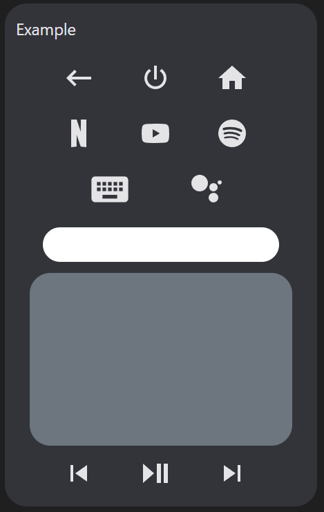
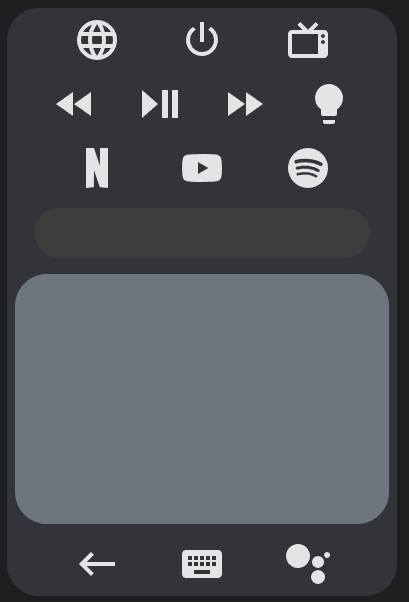
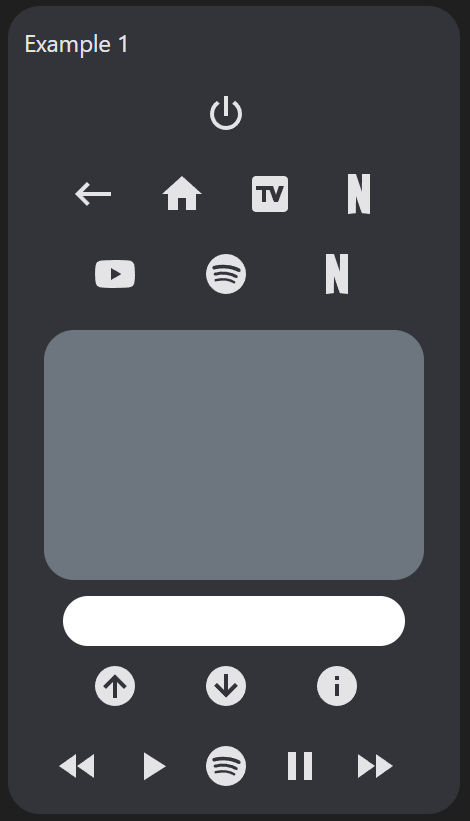
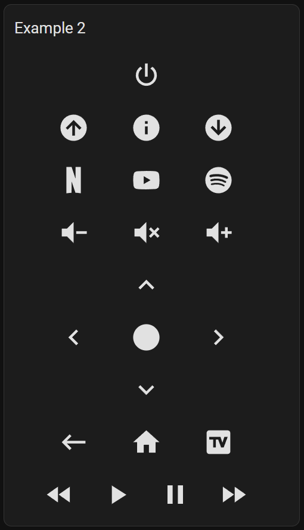
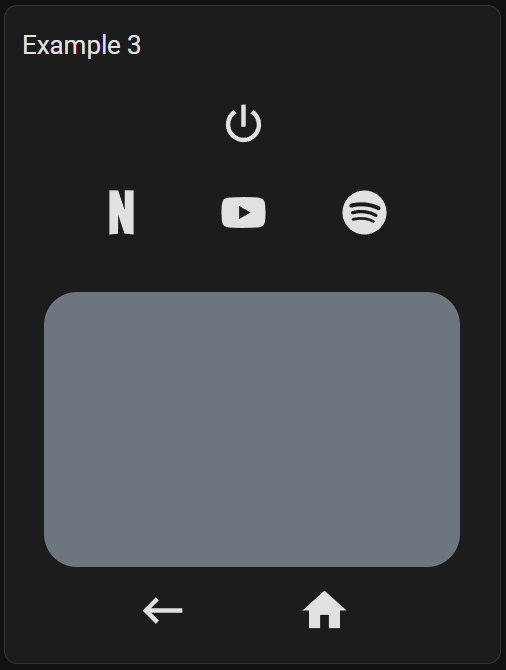
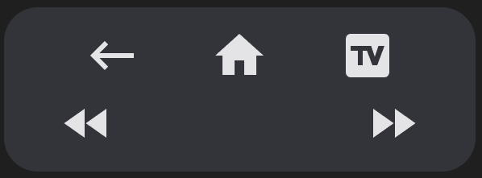

# Android TV Remote Card (with touchpad and haptic feedback)

[![GitHub Release][releases-shield]][releases]
[![License][license-shield]](LICENSE.md)
[](https://github.com/custom-components/hacs)
![Project Maintenance][maintenance-shield]
[![GitHub Activity][last-commit-shield]][commits]
[![Community Forum][forum-shield]][forum]

[![Github][github]][github]

📦 This repo is a fork of [tv-card](https://github.com/usernein/tv-card), which is a fork of another [tv-card](https://github.com/marrobHD/tv-card), and includes the same features and improvements usernein made, like:

- Fully functional touchpad for navigation (thanks to [iablon's Touchpad Card](https://github.com/iablon/HomeAssistant-Touchpad-Card)) ❤️
- Slider for volume (thanks to [AnthonMS's Slider Card](https://github.com/AnthonMS/my-cards#slider-card)) ❤️
- Supports the official (Android TV Remote integration)[https://www.home-assistant.io/integrations/androidtv_remote/]
- Much easier setup
- Implements haptics feedback
- Customizable layout, you can choose the order of the rows and buttons
- All rows and buttons are optional, you can change whatever you *(don't)* like

Vast majority of credit goes to the original authors, I barely had to modify anything to get this working for Android TV.

## Demo



## Options

| Name | Type | Requirement | Description
| ---- | ---- | ------- | -----------
| type | string | **Required** | `custom:android-tv-card`
| remote_id | string | **Required** | The `remote` entity id to control
| media_player_id | string | **Optional** | The `media_player` entity id to control, required for changing sources
| title | string | **Optional** | Card title for showing as header
| enable_double_click | boolean | **Optional** | Whether a double click on the touchpad should send the key in `double_click_keycode`. Defaults to `true`.
| double_click_keycode | string | **Optional** | The key for double clicks on the touchpad. Defaults to `DPAD_CENTER`
| enable_button_feedback | boolean | **Optional** | Shall clicks on the buttons return a vibration feedback? Defaults to `true`.
| enable_slider_feedback | boolean | **Optional** | Shall the volume slider return a vibration feedback when you slide through it? Defaults to `true`.
| slider_config | object | **Optional** | Custom configuration for the volume slider. See [slider-card](https://github.com/AnthonMS/my-cards)
| custom_keys | object | **Optional** | Custom keys for the remote control. Each item is an object that should have `icon` and at least one of the following properties: `key`, `source`, `service`.
| custom_sources | object | **Optional** | Custom sources for the remote control. Same object as above, but letting you split keys and sources.

Using only these options you will get an empty card (or almost empty, if you set a title).
In order to include the buttons, you need to specify in the config the rows you want and which buttons you want in it.
You do it by declaring the rows as arrays and its buttons as values, like this:

```yaml
power_row:
  - power
media_control_row:
  - rewind
  - play_pause
  - fast_forward
```

The available rows are `power_row`, `channel_row`, `apps_row`, `source_row` and `media_control_row`
There also `volume_row` and `navigation_row`, but these requires a string as value.

| Name | Type | Description
| ---- | ---- | -------
| volume_row | string | Can be either `slider` or `buttons`. This defines the mode you want for setting the volume (you'll see them soon below). You need to have [slider-card](https://github.com/AnthonMS/my-cards) installed in order to use `slider`.
| navigation_row | string | Can be either `touchpad` or `buttons`. This defines the mode you want for navigating around your tv (you'll also see them soon below).

## **Notice**

This card uses `remote.send_command` to send keys to the TV.

Further information on possible commands can be found on the [Home Assistant Android TV page](https://www.home-assistant.io/integrations/androidtv_remote/). If your TV is from another brand or simply the TV integration does not use `remote.send_command` for sending keys, you can still use this card by setting [custom buttons](#custom-buttons) with services to send keys to your TV (or do whatever you want) in your way (just like the original [tv-card](https://github.com/marrobHD/tv-card)).

## Custom buttons

If you want to add custom buttons to the remote control (of if you want to reconfigure the existing buttons), you can do it by adding an object to the `custom_keys` option:

```yaml
custom_keys:
  input_tv:
    icon: mdi:television-box
    key: KEY_TV
  browser:
    icon: mdi:web
    source: browser
  toggle_light:
    icon: mdi:lightbulb
    service: light.toggle
    service_data:
      entity_id: light.bedroom
```

The `custom_sources` exists for the same purpose, but you can use it to split the keys and sources.

```yaml
custom_keys:
  input_tv:
    icon: mdi:television-box
    key: KEY_TV
  toggle_light:
    icon: mdi:lightbulb
    service: light.toggle
    service_data:
      entity_id: light.bedroom
custom_sources:
  browser:
    icon: mdi:web
    source: browser
```

Then you can easily use these buttons in your card:

```yaml
power_row:
  - browser
  - power
  - input_tv
media_control_row:
  - rewind
  - play_pause
  - fast_forward
  - toggle_light
```



With custom buttons you can override existing buttons for changing its icon or even its functionality. Here I do both:

```yaml
custom_keys:
  power:
    icon: mdi:power-cycle
    service: media_player.toggle
    service_data:
      entity_id: media_player.tv
```

Inside each button you may define `icon` and either `key`, `source` or `service`, as you've seen.

| Option | internal function | Description
| ---- | ---- | -------
| icon |  | The icon to show in the button. If empty, the button will be blank.
| key | `media_player.play_media(media_content_id=key, media_content_type="send_key")` | The key to send to the TV via `media_player.play_media`
| source | `media_player.select_source(source=source)` | The source to switch to via `media_player.select_source`
| service | `_hass.callService(domain, service, service_data)` | A string representing service to call. Use the format `domain.service`, e.g. `"light.turn_on"`
| service_data | passed with `service` | The data to pass to the service. May be an object depending on the service you are using.

## Custom icons

You can customize any icon with a custom svg path using the `custom_icons` option.

Usage:

```yaml
custom_icons:
  <button>: <svg_path>
```

Example:

```yaml
custom_icons:
  hbo: >-
    M7.042 16.896H4.414v-3.754H2.708v3.754H.01L0
    7.22h2.708v3.6h1.706v-3.6h2.628zm12.043.046C21.795 16.94 24 14.689 24
    11.978a4.89 4.89 0 0 0-4.915-4.92c-2.707-.002-4.09 1.991-4.432
    2.795.003-1.207-1.187-2.632-2.58-2.634H7.59v9.674l4.181.001c1.686 0
    2.886-1.46 2.888-2.713.385.788 1.72 2.762 4.427 2.76zm-7.665-3.936c.387 0
    .692.382.692.817 0 .435-.305.817-.692.817h-1.33v-1.634zm.005-3.633c.387 0
    .692.382.692.817 0 .436-.305.818-.692.818h-1.33V9.373zm1.77
    2.607c.305-.039.813-.387.992-.61-.063.276-.068 1.074.006
    1.35-.204-.314-.688-.701-.998-.74zm3.43 0a2.462 2.462 0 1 1 4.924 0 2.462
    2.462 0 0 1-4.925 0zm2.462 1.936a1.936 1.936 0 1 0 0-3.872 1.936 1.936 0 0 0
    0 3.872Z
```

The svg path was copied from [SimpleIcon](https://simpleicons.org/?q=hbo). Although you can use [this integration](https://github.com/vigonotion/hass-simpleicons) for using icons from SimpleIcons (there's also one for [fontawesome](https://github.com/thomasloven/hass-fontawesome)).

Having defined the custom icon, you can use it on any custom button:

```yaml
custom_sources:
  hbomax:
    icon: hbo
    source: HBO Max
```

## Installation

### Step 1

Install [HACS](https://hacs.xyz/), open it, click on Frontend, click on the three dot menu in the top-right corner, click on Custom repositories, paste the URL of this repository in the repository field, and set the category to Lovelace.

### Step 2

Add a custom element in your `ui-lovelace.yaml`

```yaml
      - type: custom:tv-card
        remote_id: remote.google_chromecast
		media_player_id: media_player.google_chromecast
        power_row:
          - power
        channel_row:
          - channel_up
          - info
          - channel_down
        apps_row:
          - netflix
          - youtube
          - spotify
        volume_row: slider
        navigation_row: touchpad
        source_row:
          - return
          - home
          - source
        media_control_row:
          - rewind
          - play_pause
          - fast_forward
```

### Example 1

Playing with order, moving and repeating buttons:

```yaml
type: custom:tv-card
remote_id: remote.google_chromecast
media_player_id: media_player.google_chromecast
title: Example 1
power_row:
  - power
source_row:
  - return
  - home
  - source
  - netflix
apps_row:
  - youtube
  - spotify
  - netflix
navigation_row: touchpad
volume_row: slider
channel_row:
  - channel_up
  - channel_down
  - info
media_control_row:
  - rewind
  - play
  - spotify
  - pause
  - fast_forward
```

Result:



### Example 2

Buttons, buttons everywhere!

```yaml
type: custom:tv-card
remote_id: remote.google_chromecast
media_player_id: media_player.google_chromecast
title: Example 2
power_row:
  - power
channel_row:
  - channel_up
  - info
  - channel_down
apps_row:
  - netflix
  - youtube
  - spotify
volume_row: buttons
navigation_row: buttons
source_row:
  - return
  - home
  - source
media_control_row:
  - rewind
  - play
  - pause
  - fast_forward
```

Result:



### Example 3

Using less

```yaml
type: custom:tv-card
remote_id: remote.google_chromecast
media_player_id: media_player.google_chromecast
title: Example 3
power_row:
  - power
apps_row:
  - netflix
  - youtube
  - spotify
volume_row: slider
navigation_row: touchpad
source_row:
  - return
  - home
```

Result:



### Extra

In any row, if you add an ampty item, there will be an empty/invisible button filling the space:

```yaml
source_row:
  - return
  - home
  - source
media_control_row:
  - rewind
  -
  - 
  - fast-forward
```



[last-commit-shield]: https://img.shields.io/github/last-commit/Nerwyn/android-tv-card?style=for-the-badge
[commits]: https://github.com/Nerwyn/android-tv-card/commits/master
[forum-shield]: https://img.shields.io/badge/community-forum-brightgreen.svg?style=for-the-badge
[forum]: https://community.home-assistant.io/t/lovelace-an-awesome-modified-tv-card-with-touchpad-and-haptic-feedback/432791
[license-shield]: https://img.shields.io/github/license/Nerwyn/android-tv-card.svg?style=for-the-badge
[maintenance-shield]: https://img.shields.io/badge/maintainer-Nerwyn-blue.svg?style=for-the-badge
[releases-shield]: https://img.shields.io/github/release/Nerwyn/android-tv-card.svg?style=for-the-badge
[releases]: https://github.com/nerwyn/tv-card/releases
[github]: https://img.shields.io/github/followers/Nerwyn.svg?style=social
